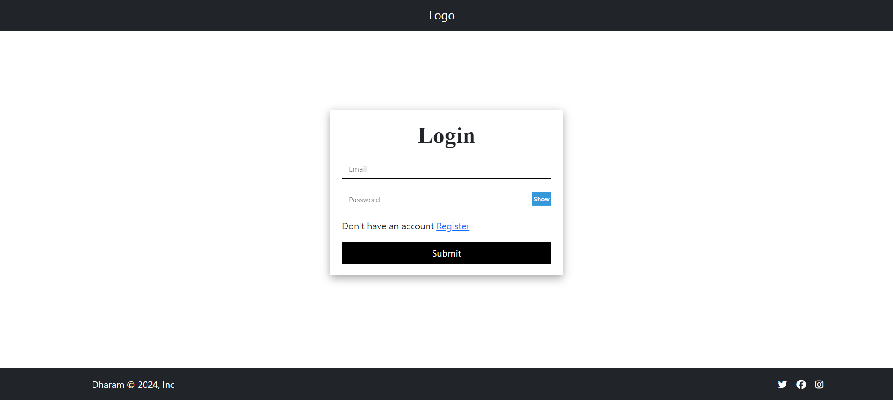
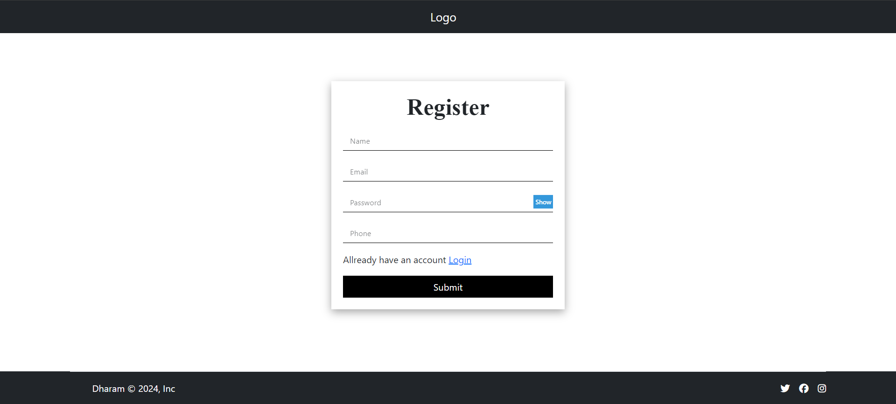

# MERN Stack Login/Register Page

This project demonstrates a basic login and register page using the MERN (MongoDB, Express.js, React.js, Node.js) stack.

## Overview

- **MongoDB**: Database to store user information.
- **Express.js**: Server-side framework to handle HTTP requests.
- **React.js**: Front-end framework for building user interfaces.
- **Node.js**: JavaScript runtime environment for server-side development.

## Screenshots


*Screenshot of the login page.*


*Screenshot of the register page.*

## Features

- User registration with password hashing.
- User login with password validation.
- Responsive design for a better user experience.

## Getting Started

1. Clone the repository:

    ```bash
    git clone https://github.com/dharamraj-dev/Mern-Simpler-Login-Register
    ```

2. Install dependencies:

    ```bash
    cd your-repo
    npm install
    ```

3. Set up the environment variables:

    Create a `.env` file in the root directory and add the following:

    ```env
    REACT_APP_API=http://localhost:your-api-port
    ```

4. Run the application:

    ```bash
    npm start
    ```

    The app will be available at `http://localhost:3000` by default.

## Contributing

Feel free to contribute by opening issues or pull requests. Feedback and suggestions are welcome!

## License

This project is licensed under the [MIT License](LICENSE).

